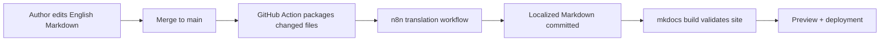

# Documentation Demo

This environment showcases how an English-first documentation workflow evolves into a multilingual site with minimal manual intervention. The repository intentionally mirrors a production-ready structure so you can evaluate automation coverage, experiment with glossary changes, and rehearse translation QA.

## What You Can Explore

The following checklist represents the recommended path for new contributors:

1. Run `mkdocs serve` and navigate between `/en/`, `/es/`, and `/fr/` to confirm the static-i18n plugin mirrors content correctly.
2. Open the Actions tab in GitHub to inspect past translation runs. Pay special attention to the payload relayed to n8n and the files returned to the workflow.
3. Update one of the English Markdown files under `docs/en/`—even a small change—to see how the automation isolates the diff and sends only the modified files for translation.
4. Review the auto-generated commits tagged with `chore: update localized docs` after translations land. These commits illustrate the file layout expected by MkDocs.

!!! tip "Try the language selector"
    Use the footer dropdown to swap locales. The underlying navigation integrates the new **Localization Playbook** entry so you can verify translations span nested menus.

## Reference Workflow

The high-level flow remains consistent even as you scale to additional locales:

## Release Checklist

Before shipping a documentation update, walk through this checklist:

- **Glossary alignment** — Confirm glossary changes are included in `automation/prompts/glossary.json` to keep terminology consistent.
- **Translation QA** — Follow the [Localization Playbook](guides/localization-playbook.md) to review generated Markdown, focusing on links, callouts, and code snippets.
- **Build verification** — Run `mkdocs build` locally or download the GitHub Action artifact to ensure no locale emits warnings about missing pages.
- **Stakeholder update** — Summarize key updates and affected locales in the release notes or changelog.

## How the Demo Works

1. Author updates land in `docs/en/`.
2. GitHub Actions detects merged changes and pushes the diff to n8n.
3. n8n translates the content and commits localized Markdown files under `docs/<lang>/`.
4. MkDocs rebuilds the static site, producing `/en/`, `/es/`, and `/fr/` language variants.

See the [Translation Workflow](guides/translation-flow.md) guide for implementation details.
